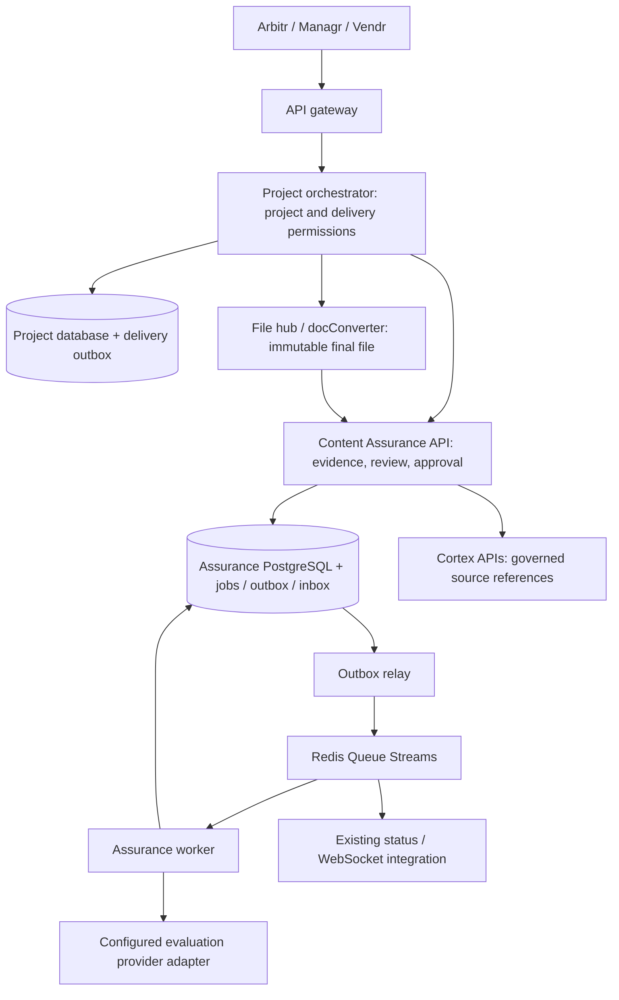

# Content Assurance × Arbitr: stack compatibility and integration design

Reviewed 9 September 2026 against `strakergroup/cloud-product-y-mono` commit **`66025d47971cf436a75618887a49eb02584a7f2c`**. The README, architecture guide and relevant implementation files were read through authenticated, read-only repository access. This review changes the integration approach; it does not install a service into Arbitr or certify production interoperability.

## Decision

**The approach fits Arbitr as a separate FastAPI backend service, with assessment and human approval integrated into the existing project workflow.** Retain the rubric, evidence model, immutable versions, deterministic scorer and explicit release gates. Use Arbitr's PostgreSQL, identity, Redis, file and frontend conventions for production integration.

The supplied implementation is a working **single-host SQLite pilot**. Its Python API is compatible with the backend language and framework, but its storage, authentication and delivery adapters are not production integrations. PostgreSQL is a required implementation step, not a connection-string change. Do not deploy the current SQLite file on a shared Kubernetes volume or treat a successful local demonstration as a platform acceptance test.

## Fit with the stack

| Arbitr component | Integration decision | Current handoff |
|---|---|---|
| Python 3.12, FastAPI, Pydantic 2, Uvicorn | Keep the existing assessment core and typed HTTP contract. Wrap it in the service's `app/main.py` entry point. | Implemented and locally tested on Python 3.12. |
| Pipenv and per-service packaging | Add a service `Pipfile` and lockfile, with the normal test, lint and typecheck dependencies; use monorepo Make targets. The existing wheel can be a dependency. | Standalone package currently uses `uv.lock`; no Pipenv lock generated or verified. |
| PostgreSQL 16, SQLAlchemy, Alembic | Give assurance its own database, provisionally `dbcontent_assurance`, and port persistence and migrations. | SQLite only; PostgreSQL port and concurrency validation required. |
| Redis 8 with separate queue/cache deployments | Use `libraries/arbitr-redis` for cluster-aware Streams and optional cache. Keep authoritative work and release state in PostgreSQL. | Durable local database jobs exist; Redis integration does not. |
| Nuxt 4 / Vue 3, Nuxt UI 4, Pinia 3, TypeScript | Add review/status views to the existing apps using their API helper, through the gateway. | Typed OpenAPI available; no Arbitr UI integration. |
| Docker/Compose and Kubernetes | Add the API, worker, migration job and required environment settings to the existing deployment structure. | No Arbitr container build or cluster validation performed. |

Stack source: [README at the reviewed commit](https://github.com/strakergroup/cloud-product-y-mono/blob/66025d47971cf436a75618887a49eb02584a7f2c/README.md). Packaging example: [quality-evaluation Pipfile](https://github.com/strakergroup/cloud-product-y-mono/blob/66025d47971cf436a75618887a49eb02584a7f2c/services/quality-evaluation/Pipfile).

## Service boundaries

These are proposed connections. No browser calls the assurance backend directly. No service reads or writes another service's database.

Suggested service directory: `services/content-assurance-service/`, with the normal `app/`, `tests/`, `Pipfile`, `Dockerfile`, `.env.example` and Alembic structure. Keep `assurance/rubric.py` independent of infrastructure. Refactor the current connection-dependent service and worker code behind SQLAlchemy persistence functions; a FastAPI wrapper alone does not perform that port.

The project orchestrator owns the relationship between project, file target, deliverable and assessment. Store an organization-scoped mapping to the assurance asset/version/run plus the exact content hash. Map **each immutable file revision and target locale** separately; a project's overall completion state cannot approve every file version. Preserve parent/derived-version links for translations and adaptations.

## Gateway identity, authorization and contracts

The current gateway validates an `access_token` cookie or bearer JWT, strips inbound identity headers, then forwards authenticated identity. The orchestrator also validates JWTs. The local assurance bearer keys use a different scheme and cannot accept these JWTs as-is. Sources: [gateway authentication](https://github.com/strakergroup/cloud-product-y-mono/blob/66025d47971cf436a75618887a49eb02584a7f2c/services/api-gateway/app/dependencies.py), [forwarding](https://github.com/strakergroup/cloud-product-y-mono/blob/66025d47971cf436a75618887a49eb02584a7f2c/services/api-gateway/app/routers/proxy.py), [orchestrator authentication](https://github.com/strakergroup/cloud-product-y-mono/blob/66025d47971cf436a75618887a49eb02584a7f2c/services/project-orchestrator/app/utils/auth.py).

Use project-scoped orchestrator routes, proposed as `/api/projects/{project_obj_id}/assurance/...`, for frontend operations. They already fall under the project's gateway route. Explicitly map these to the existing assurance `/v1/...` operations; path rewriting and identity translation are integration work. Reuse the frontend API helper's cookie handling and normalize assurance errors into the existing `detail` error contract, retaining a stable machine-readable error code. Do not silently return HTTP 200 for a blocked release.

The production assurance identity adapter must verify the platform identity or a narrowly scoped, authenticated delegation from the orchestrator. It must bind organization, human actor, permissions and relevant project access. Forwarding unverified `X-Org-Id` or accepting an arbitrary actor ID beside one all-powerful service key is insufficient.

Map organization identity to the assurance tenant and platform user identity to a durable assurance principal. Assign `reviewer`, `specialist`, source/policy administrator and named `approver` permissions explicitly. An Arbitr organization owner/admin role alone does not establish specialist competence or make its holder the brief's named approver. Background machine identities may submit work; they must not impersonate human review. Resolve Managr organization scope and Vendr assignment scope server-side. The pilot's tenant-wide read access is too broad for arbitrary vendor access; enforce project/document permissions on all read, evidence and mutation paths before exposing them through those apps.

For final human decisions, verify current authorization and token revocation. The reviewed gateway deliberately tolerates denylist-cache outages; assurance approval/release must have an explicit stricter policy if current revocation cannot be established. Missing identity or organization claims must fail closed.

Expose UUID values, never numeric database IDs. Resolve resource access in the organization scope before calling assurance. Normalize languages using client-service's canonical reference and the orchestrator's `to_bcp47(...).lower()` helper. Because the helper can return an unresolved input unchanged, verify that a reference row exists before approving source scope; do not guess a language region. Apply the same canonical value to briefs, approved resources and target-file mappings. See [repository conventions](https://github.com/strakergroup/cloud-product-y-mono/blob/66025d47971cf436a75618887a49eb02584a7f2c/AGENTS.md) and [language reference implementation](https://github.com/strakergroup/cloud-product-y-mono/blob/66025d47971cf436a75618887a49eb02584a7f2c/services/project-orchestrator/app/services/languages.py).

## PostgreSQL and event processing

Port all mutable and immutable records, unique constraints, append-only protections and the migration checksum/version policy. Replace SQLite-specific SQL, BLOB handling and `BEGIN IMMEDIATE` with PostgreSQL operations. Preserve exact rational scoring; serialization/display rounding must not become a release decision input.

Design one consistent lock order for content heads, dependency heads, runs and release records. Release and invalidating mutations must contend on the same authoritative records. Use row locks and conditional updates for version changes and approvals. Claim jobs with `FOR UPDATE SKIP LOCKED` or an equivalent tested pattern, and retain lease-token fencing, renewal and bounded retries. A per-tenant serialized lock is a reasonable initial correctness boundary if its throughput is measured; the final row-lock design must also prevent source-revocation and approval races.

Save content, run, dependencies, durable job and outbound event in **one assurance database transaction**. On the platform side, commit the saved platform revision and an intake outbox entry together. The relay retries submission with the same event ID, caller identity and payload hash. Mark an outbox item dispatched only after acknowledgement. Duplicate delivery is expected; use a durable inbox/uniqueness constraint rather than Redis TTL as the sole deduplication guarantee. A cache eviction must not permit a second approval or release.

Use `RedisSettingsMixin`, `create_redis`, `QueueClient` and `ConsumerClient` from the shared library. The actual monorepo dependency path is `../../libraries/arbitr-redis`; the library README's `libs/` example is stale. Queue configuration uses `REDIS_QUEUE_*`; cache uses `REDIS_CACHE_*`. Verify both local non-cluster mode and production cluster mode. `publish_many` uses independent, non-transactional Redis writes: it cannot atomically commit a SQL transaction. Sources: [queue implementation](https://github.com/strakergroup/cloud-product-y-mono/blob/66025d47971cf436a75618887a49eb02584a7f2c/libraries/arbitr-redis/src/arbitr_redis/queue/client.py), [consumer implementation](https://github.com/strakergroup/cloud-product-y-mono/blob/66025d47971cf436a75618887a49eb02584a7f2c/libraries/arbitr-redis/src/arbitr_redis/queue/consumer.py).

**Retry behavior matters:** the reviewed consumer sends a raised processing exception to `<stream>:failed` and then acknowledges the original when dead-lettering succeeds. Returning `False` retains it for retry. Cancellation and a failed dead-letter write retain pending work. Configure bounded retries and return `False` for transient failures after rolling back; merely setting `max_deliveries` does not turn raised exceptions into automatic retries. A successful handler acknowledges only after its durable transaction commits. Prefer workers to recover authoritative jobs from PostgreSQL as well, so missed/trimmed wake-up events cannot strand an assessment.

Proposed new stream defaults, configurable per environment:

- `arbitr:content-assurance:assessment:input`
- `arbitr:content-assurance:assessment:output`
- The consumer library's `<input-stream>:failed` dead-letter stream.

Use a fresh, minimal, versioned event contract, following the current HITL pattern rather than guessing an existing MT/agent envelope. Proposed fields: `schema_version`, `event`, `event_id`, `correlation_id`, `org_id`, `project_obj_id`, `asset_id`, `version_id`, `run_id`, `content_hash`, `revision`, `ts`. Encode Redis field values as strings. Use IDs to fetch immutable payloads through authorized APIs; do not send review text or original binaries as broadcast status. Consumers validate organization/object relationships and reject out-of-order revisions. Stream names above are proposals, not existing subscriptions. See [HITL event example](https://github.com/strakergroup/cloud-product-y-mono/blob/66025d47971cf436a75618887a49eb02584a7f2c/services/project-orchestrator/app/hitl/events.py).

## Assessment, Cortex and document conversion

Keep existing MTQE and agent findings as potential evidence inputs with their own provenance, model versions and scope. **An MTQE confidence score is not the assurance index, rubric coverage, human approval or a release authorization.** Do not rescale a 0–1 MTQE result to 0–100 and use it as a rubric score. The assurance rubric remains provisional and uncalibrated.

Fetch terminology, translation memory and reference material through `org-brain-service` APIs; use **Cortex** in the UI. Retrieval rank, a TM match or generated output does not confer source approval. Record the exact source revision, approval authority, validity, locale, market and allowed use. Copy an immutable evidence snapshot into assurance under a stable external reference; do not join the Cortex database or read Elasticsearch directly as an authority bypass. Source changes require revision-aware invalidation and reconciliation. An asynchronously mirrored source status alone cannot establish that no revocation has occurred at delivery time.

Retain file hub and docConverter as the platform's file and conversion services. Bind segment evidence to original asset, file target, segment/unit identifiers, offsets and extraction version. XLIFF is not a supported direct format in the pilot; add a typed segment/document adapter with explicit coverage gaps, or submit a supported final document. Passing flattened segments as plain text must not imply that tables, layout, images or the final rendered document were examined.

Assess the final merged file, and any later human-uploaded, DTP-adjusted or PDF-converted replacement, before allowing its delivery. Its file-hub asset/version and byte hash must match the release. Existing scan-watch/malware checks remain necessary but do not satisfy assurance. Unsupported formats and excessive file sizes must remain explicit holds; the pilot accepts only its documented formats and caps uploads at 5 MB. Larger platform uploads require a separately designed bounded extraction path, not silently dropping pages or splitting away document-level checks.

The generic HTTPS Chat Completions adapter can be retained only for a verified compatible endpoint/model. Arbitr's Model Factory client uses an internal-secret and identity-header contract; pointing `CAS_PROVIDER_URL` at it does not implement that contract. Add the platform provider adapter, confirm structured-output support and preserve consent, tenant scoping, timeouts, provenance and malformed-output failure behavior. No live Model Factory or other model request was made in this review. Source: [existing Model Factory client](https://github.com/strakergroup/cloud-product-y-mono/blob/66025d47971cf436a75618887a49eb02584a7f2c/services/integrations-service/app/clients/model_factory.py).

## Delivery enforcement: the critical integration

The code has several delivery entrances: manual project publish, automatic publish events, incremental merged deliverables, single-file downloads, ZIP downloads and public API download forwarding. Checking only the browser's Publish button leaves other paths outside assurance. The current automatic-publish path also has an `auto_publish_ignore_threshold` setting; it must never bypass the separate assurance requirement. Sources: [project routes](https://github.com/strakergroup/cloud-product-y-mono/blob/66025d47971cf436a75618887a49eb02584a7f2c/services/project-orchestrator/app/routers/projects.py), [pipeline handlers](https://github.com/strakergroup/cloud-product-y-mono/blob/66025d47971cf436a75618887a49eb02584a7f2c/services/project-orchestrator/app/pipeline/handlers.py), [public API delivery forwarding](https://github.com/strakergroup/cloud-product-y-mono/blob/66025d47971cf436a75618887a49eb02584a7f2c/services/integrations-service/app/v1/deliverables.py).

Add one shared server-side assurance policy to delivery selection and authorization. Review these concrete integration points:

| Location | Required behavior for content requiring assurance |
|---|---|
| `publish_project` and automatic publish handling | Require the current exact-version approval; existing auto-publish settings cannot waive it. Machine publication executes an already authorized delivery and does not create human approval. |
| `handle_merge_result`, `bridge_merged_batch_to_clearance`, `handle_clearance_evaluated` | Register/reassess final artifacts as held candidates. Project completion or an incremental merge must not make an unapproved file visible. |
| Deliverable list, pending counts and per-batch list | Apply assurance visibility alongside existing DTP/manager holds. Internal reviewer access remains a separately authorized route. |
| `download_deliverable`, `get_deliverables_zip` and underlying selection helpers | Check authorization before the first byte. For ZIPs, establish an approved immutable manifest before streaming; a later entry must not bypass checks. |
| Public REST, integration delivery and direct file routes | Enforce the same exact-artifact rule. Audit any file-hub URL, cached link or alternate connector path that could expose a held deliverable. |

Bind delivery to organization, platform deliverable revision, assurance version, content hash, current snapshot ID/hash, named-owner approval and governance revision. Never use a WebSocket update, cached `release_eligible`, or an old release ID as a permanent permission.

**Cross-service atomicity is still an implementation requirement.** The current `/release` transaction serializes assurance's own state only. It cannot atomically commit an orchestrator row or a file-hub response. A production delivery protocol must specify its authorization point, durable idempotent delivery attempt, expiry/revalidation rules, cancellation handling and the effect of source revocation between authorization and transmission. Coordinate authoritative source-revision changes with this protocol; a delayed Redis invalidation is insufficient for immediate revocation guarantees. Decide and test these semantics before claiming prevention. An outbox solves lost delivery work, but by itself does not solve stale authorization or revoke bytes already delivered.

Existing project workflow and MT quality statuses should remain distinct from assurance status. Add a separate assurance state and hold reason rather than changing the meaning of `completed`, `published` or translation confidence. Use WebSocket updates for progress only, and refetch authoritative state for actions.

## Implementation and acceptance sequence

1. **Persistence:** SQLAlchemy/PostgreSQL port; Alembic migrations with one head and revision IDs at most 32 characters; migrations run in the deployment migration/init step. Prove exact-version and revocation locking before scaling workers.
2. **Identity and contract:** authenticated platform delegation/JWT adapter, explicit role grants, per-project permissions, UUID mapping, canonical locale validation and consistent error responses.
3. **Platform intake and jobs:** orchestrator revision mapping, durable outbox/inbox, shared Redis library wiring, duplicate handling, visible failed work and source-change reconciliation.
4. **Evidence and files:** Cortex provenance/approval mapping, segment/document adapter, final-file hashes, conversion coverage and configured evaluation-provider adapter.
5. **Human workflow and delivery:** existing app views, named-owner/specialist actions, all delivery entrances, and the defined cross-service authorization protocol.
6. **Rollout:** start with shadow assessments to calibrate and inspect evidence. Label that mode as monitoring. Enable enforcement only for explicitly configured content after the acceptance checks pass; unresolved assessments then hold delivery.

Required acceptance scenarios include:

- Invalid/expired/revoked identity; wrong organization; unassigned vendor; forged identity header; machine attempts to approve; stale role or owner.
- Concurrent content saves, approval versus edit, release versus revocation/expiry, two workers claiming one job, lease expiry and late completion, plus ordered governance locks without deadlock.
- SQL commit followed by a relay crash; duplicate/redelivered event; temporary Redis outage; pending retry; dead-letter failure; cache eviction; out-of-order completion and source-change events.
- Approved segments followed by changed merge/DTP/PDF bytes; missing source region; unsupported extraction; omitted page; source revision changed before delivery.
- Manual publish, auto-publish with threshold bypass enabled, incremental delivery, each download route, ZIP manifests, public API and any file/connector bypass; all require the current exact artifact and authorization.
- Dependency failure or delayed invalidation during the defined delivery protocol; attempts cancelled or resumed after approval expires; repeated delivery attempt IDs cannot authorize a different payload.

Follow the monorepo's test policy: default tests are hermetic, with fake Redis and mocked external HTTP. Use suitable SQLite variants for model tests where appropriate; SQLite tests cannot prove PostgreSQL locking. Run explicitly selected concurrency/migration integration checks against an isolated, disposable PostgreSQL 16 instance, and cluster behavior checks against isolated Redis, never configured live platform data. Use existing Make targets (`test-service`, `lint`, `typecheck`, `build-service`, `migrate`) after registering the service.

**Verification boundary:** the existing 90 passing tests and offline HTTP/worker demonstration establish the standalone pilot behavior. This compatibility review establishes a source-backed integration design. None of the PostgreSQL, Redis, JWT/delegation, Nuxt, Model Factory, file-hub or production delivery integration scenarios above has been executed against Arbitr. Runtime code and the rubric were not changed in this documentation revision.
